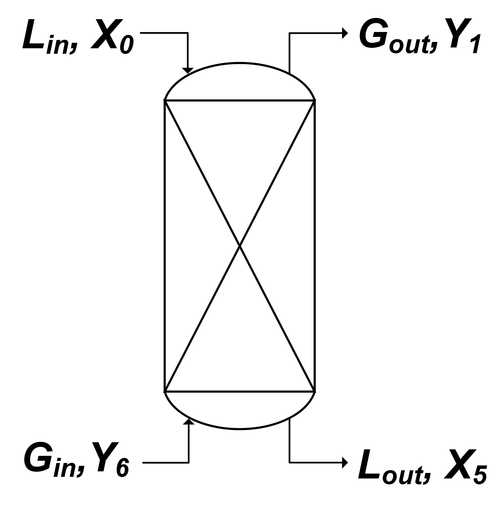

# Data-Driven MPC Coursework

This repository contains the third coursework for the Machine Learning for Chemical Engineering class. The project focuses on creating a Data-Driven Model Predictive Controller to control a multistage liquid extraction column.

<p align="center">
  
</p>

## Installation

## Usage

Create your algorithm in the `your_alg.py` file.
Test it with either `control_task.py` or `evaluate.py`
In your terminal:
```bash
cd ./src/
python evaluate.py
```

### Task 
In this coursework, you will design a data-driven model predictive controller (MPC) to control a multistage extraction column. You have complete freedom to create your own data-gathering routine, data-driven model (neural network, decision tree etc.) and control horizon optimisation routine which all work together to form the controller. Since the takeaway is on optimising chemical engineering systems, we operate under the following assumption:
-	Evaluations are expensive, meaning that the runtime of the model training is limited by a fixed evaluation budget rather than a time budget constraint. This means that your exploration routine can only evaluate the system 5 times.
-	The data-gathering, model training and the control horizon optimisation routine will also be time limited to a budget of 2 mins for data-gathering and model training, and 5 min for controller optimisation (time to complete one simulation with the controller active)

Your team’s submission will be **three** functions:
  1. Data-gathering routine
  2. Model training
  3. Controller

These form your best attempt at controlling the multistage extraction column system using a data-driven MPC.
